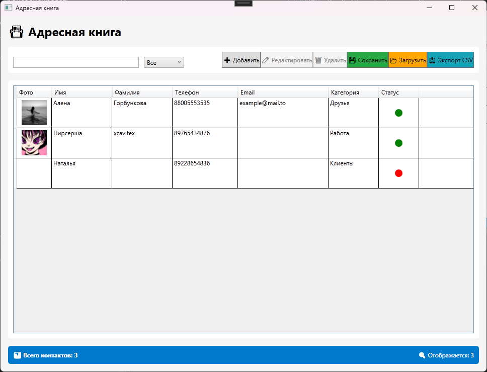
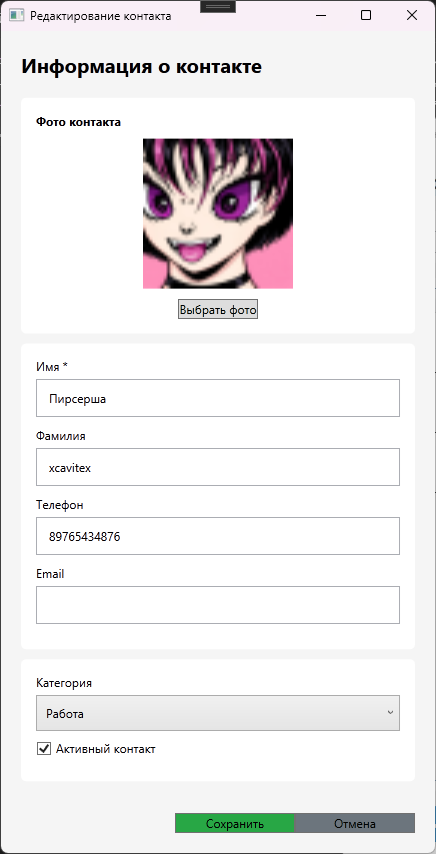

# 📒 Адресная книга (WPF)

Десктопное приложение для управления контактами, разработанное на платформе .NET 6.0 с использованием технологии WPF. Позволяет удобно хранить, организовывать и обрабатывать список личных или рабочих контактов.

> **Статус проекта:** Учебный  
> **Платформа:** Windows

---

## 📋 Описание

Приложение предназначено для личного пользования или малых бизнес-задач. Оно предоставляет простой и интуитивно понятный интерфейс для ведения базы контактов без необходимости подключения к внешним серверам или сложным СУБД. Все данные хранятся локально в формате JSON.

## ✨ Возможности

- **CRUD операции:** Полноценное создание, чтение, редактирование и удаление контактов.
- **Поиск и фильтрация:** Быстрый поиск по базе контактов для удобства навигации.
- **Валидация данных:** Проверка корректности введенных данных (например, формат телефона или email).
- **Импорт/Экспорт:**
  - Сохранение и загрузка базы данных в формате **.json**.
  - Экспорт списка контактов в формат **.csv** (для открытия в Excel).
- **Архитектура:** Построено на паттерне **MVVM** (самописная реализация), что обеспечивает чистоту кода и разделение логики и интерфейса.

## 🖼️ Скриншоты

*Главное окно приложения*

*Окно добавления/редактирования контакта*

## 🛠️ Технологический стек

|             Технология            |                        Описание                     |
|-----------------------------------|-----------------------------------------------------|
| **.NET 6.0**                      |                  Платформа разработки               |
| **WPF**                           | Фреймворк для создания пользовательского интерфейса |
| **MVVM**                          |     Архитектурный паттерн (Custom Implementation)   |
| **JSON**                          |                 Формат хранения данных              |
| **System.Text.Json**              |              Библиотека для работы с JSON           |
| **Microsoft.Bcl.AsyncInterfaces** |             Поддержка асинхронных операций          |

## 🚀 Как запустить

### Системные требования
- ОС: Windows 10/11
- Установленный **.NET 6.0 Runtime** (или SDK)
  - [Скачать .NET 6.0](https://dotnet.microsoft.com/en-us/download/dotnet/6.0)

### Запуск готовой версии
Если вы скачали проект с уже скомпилированными файлами:

1. Перейдите в папку с проектом.
2. Откройте папку `bin`.
3. Далее перейдите в `Release` → `net6.0-windows`.
4. Запустите файл `AddressBook.exe`.

> **Примечание:** Настройка дополнительных параметров не требуется. Приложение готово к работе сразу после запуска.

### Запуск из исходного кода (для разработчиков)
Если вы клонировали репозиторий:

1. Откройте решение (`.slnx`) в Visual Studio 2026 или выше.
2. Восстановите NuGet-пакеты.
3. Нажмите `F5` или кнопку "Запуск" для сборки и отладки.

## 📂 Структура данных

Данные сохраняются локально в файле формата `.json`. Это позволяет легко переносить базу контактов между компьютерами просто скопировав файл.

## 📄 Лицензия

Проект является учебным. Лицензия не указана. Все права защищены.

---

*Разработано в учебных целях.*
